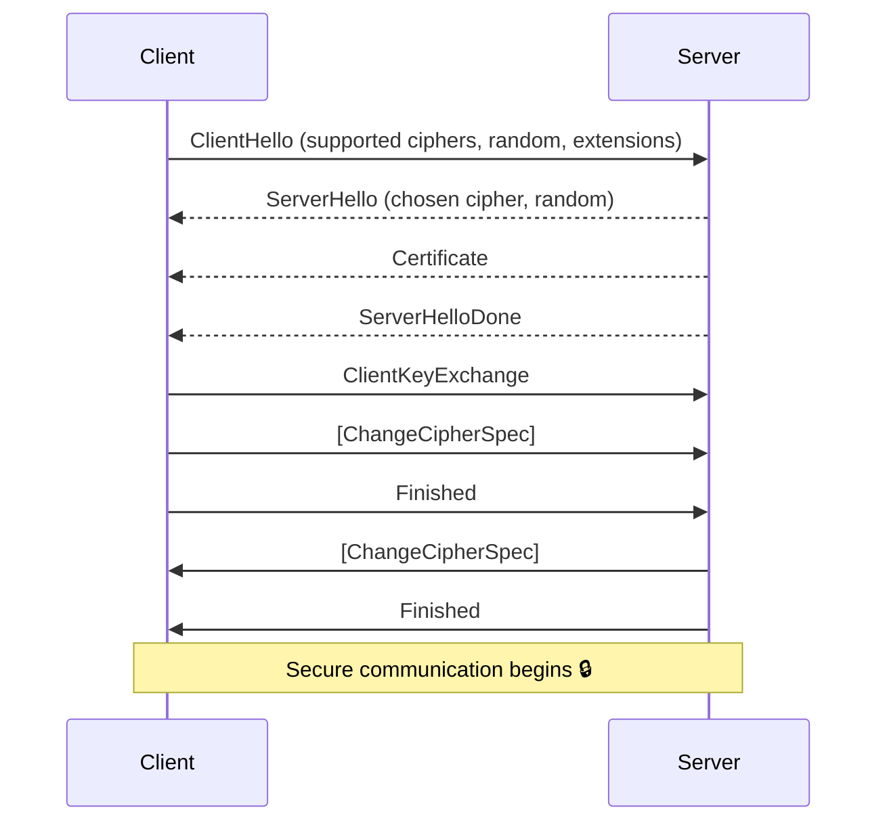

# Forward Secrecy

This project provide explanation and implementation of forward secrecy technique in networking security.

## What is Forward Secrecy

### TLS 1.2
- TLS stands for Transport Layer Security, a protocol for ensuring secure communication.
- There are several version of TLS protocol but the most commonly used nowadays is TLS 1.2 and 1.3.
- TLS handshake is a process of establishing secure communication before start sending 
  actual information between server and client.
- Process of TLS handshake:
  Generally, the tls handshake can be grouped by 4 main processes: sending the server's public key,
  sending session key, ensuring client has the correct key set, and ensure the server has the
  correct key set.
  1. Client hello: 
     Sends some info including the random number, [cipher suites](../introduction.md#cipher-suite), etc
  2. Server hello:
     Reply with the same format but updated random number generated by the client.
     After this process, both client and server has the following shared value: version, session id,
     random from client, random from server, cipher suites.
  3. Certificate: 
     Sends server's certificate chains to the client. Now the client has the certificate and server's 
     public key
  4. Server Hello Done :
     Server tells the client that no more data to send
  5. Client Key Exchange:
     By receiving the certificate, client can ensure that the certificate is legitimate, but how does the 
     client know that the certificate is indeed own by the server? This is the purpose of this exchange
     alongside with the exchange of `SEED` value. Client generate random number, encrypt it using server
     public key, called `PreMasterSecret`. Only the legitimate server can decrypt it because it has
     the correct private key. This is the proof that the public key is own by the correct server.
     The process continues by derive `MasterSecret` using `PreMasterSecret` which has already been shared.
     ```
     PremasterSecret +'master secret' + Client Random + Server Random = Master Secret
     MasterSecret + 'key expansion' + Client Random + Server Random  = Session Keys
     ```
     Session key is used for 2 channels, that is channel for sending data from server to client and vice versa.
     After these session keys is shared in both of the parties, the next step is to make sure that both has
     the exact same session keys
  6. Finished:
     Process to prove to the server that client has the correct session keys. Achieved by sending
     `Encripted Verification` which is a hash of all message form previous handshake (step 1 to 5). 
     ```
     Master secret + 'client finished' + handshake hash + encryption = Encrypted Verification
     ```
     All of these data are exist in the server side, so the server can see whether it is match or not.
  7. Finished:
     Process to prove to the client that server has the correct session keys. Achieved by sending
     `Encripted Verification` which is a hash of all message form previous handshake (step 1 to 6). 
     ```
     Master secret + 'server finished' + handshake hash + encryption = Encrypted Verification
     ```



### Diffie-Hellman

### Why use Forward Secrecy

### TLS 1.3


## Implementation

## Result