# Forward Secrecy

This project provide explanation and implementation of forward secrecy technique in networking security.

## What is Forward Secrecy

### TLS 1.2
- TLS stands for Transport Layer Security, a protocol for ensuring secure communication.
- There are several version of TLS protocol but the most commonly used nowadays is TLS 1.2 and 1.3.
- TLS handshake is a process of establishing secure communication before start sending 
  actual information between server and client.
- Process of TLS handshake:
  Generally, the tls handshake can be grouped by 4 main processes: sending the server's public key,
  sending session key, ensuring client has the correct key set, and ensure the server has the
  correct key set.
  1. Client hello: 
     Sends some info including the random number, [cipher suites](../introduction.md#cipher-suite), etc
  2. Server hello:
     Reply with the same format but updated random number generated by the client.
     After this process, both client and server has the following shared value: version, session id,
     random from client, random from server, cipher suites.
  3. Certificate: 
     Sends server's certificate chains to the client. Now the client has the certificate and server's 
     public key
  4. Server Hello Done :
     Server tells the client that no more data to send
  5. Client Key Exchange:
     By receiving the certificate, client can ensure that the certificate is legitimate, but how does the 
     client know that the certificate is indeed own by the server? This is the purpose of this exchange
     alongside with the exchange of `SEED` value. Client generate random number, encrypt it using server
     public key, called `PreMasterSecret`. Only the legitimate server can decrypt it because it has
     the correct private key. This is the proof that the public key is own by the correct server.
     The process continues by derive `MasterSecret` using `PreMasterSecret` which has already been shared.
     ```
     PremasterSecret +'master secret' + Client Random + Server Random = Master Secret
     MasterSecret + 'key expansion' + Client Random + Server Random  = Session Keys
     ```
     Session key is used for 2 channels, that is channel for sending data from server to client and vice versa.
     After these session keys is shared in both of the parties, the next step is to make sure that both has
     the exact same session keys
  6. Finished:
     Process to prove to the server that client has the correct session keys. Achieved by sending
     `Encripted Verification` which is a hash of all message form previous handshake (step 1 to 5). 
     ```
     Master secret + 'client finished' + handshake hash + encryption = Encrypted Verification
     ```
     All of these data are exist in the server side, so the server can see whether it is match or not.
  7. Finished:
     Process to prove to the client that server has the correct session keys. Achieved by sending
     `Encripted Verification` which is a hash of all message form previous handshake (step 1 to 6). 
     ```
     Master secret + 'server finished' + handshake hash + encryption = Encrypted Verification
     ```


### Diffie-Hellman
- DH (Diffie-Hellman) is a cryptography algorithm for exchanging key - using prime number and modulo - 
  without transmitting each private key.
- Look at this algorithm
  `a` => client private key
  `b` => server private key
  `g` => generator modulo `n`, usually small number  (public)
  `n` => very big prime number (public)

- Due to module property, `((g^a)^b)mod n` is equal to `((g^b)^a)mod n`
- This value is used as key for encryption later on
- Using exponential and modulo operation is like a 'color-mixing' scenario.
  It is very difficult to extract or to know the exact value before mixing.
- Even if attacker sniffing the transmission, it is mathematically difficult
  to know the exact `a` and `b` because of discrete logarithm problem somehow
  'combines' those value with `g` and `n`. Attacker have to do brute force
  to know the exact private key which is very difficult and time consuming
- This ensure the exchange of each private key without transmitting  it directly

### Why use Forward Secrecy
- In older setup of TLS (such as TLS without forward secrecy), there is a risk
  if an attacker record the https traffic.
- Assume that there is an attacker that capture all the data transmitted over
  a HTTPS. Although it is encrypted using the TLS 1.2, the attacker can still
  record it even though they can't understand it.
- If somehow the private key is compromised (maybe a couple month later),
  the attacker can still decrypt the recorded information and finally all the 
  data is leaked. 
- One of the reason of private key leakage is `Heartbleed` attack that you can
  read [here](/demo/heartbleed/README.md).
- Forward secrecy is a security practice for ensuring even if the private key is 
  exposed, the attacker still can't read the previous message because the session
  keys are ephemeral (new ones for every session). 
- This is implemented using `ephemeral Diffie-Hellman` algorithm.
- Long term private/public is not for encryption, but only for authentication.
- So the session keys is generated each time new session is created.
- But why FS has something to do with the DH? Can we generate new private key
  for each session? Technically yes, but it is not a very good approach. 
  For each newly generated keys, the client must ensure that the key is legitimate
  and belongs to the server. Instead, we can use DH to generate ephemeral key
  for each session. It is faster to generate and has smaller handshake messages.


### TLS 1.3
- TLS 1.3 is the latest version of TLS protocol, designed to improve both **security** and **performance** compared to TLS 1.2.  
- Key improvements:
  - Forward Secrecy is **mandatory** (all cipher suites use ephemeral Diffie-Hellman).  
  - Fewer round trips (1-RTT vs 2-RTT in TLS 1.2).  
  - Legacy/weak algorithms (like RSA key exchange, SHA-1, etc.) removed.  
  - Simplified handshake with fewer steps.  

#### TLS 1.3 Handshake Process
1. **ClientHello**  
   - Client sends supported cipher suites, key share (ephemeral Diffie-Hellman public key), and extensions.  

2. **ServerHello**  
   - Server selects cipher suite, sends its own ephemeral DH public key, and server certificate (signed by CA).  
   - Server proves ownership of the certificate using its long-term private key (signature).  

3. **Key Exchange & Shared Secret**  
   - Both client and server compute the shared secret using their ephemeral DH keys.  
   - This guarantees Forward Secrecy (unique keys per session).  

4. **Finished (Client and Server)**  
   - Both sides derive traffic keys and send a “Finished” message encrypted with the new keys.  
   - At this point, both confirm they derived the same session keys.  

After this, secure communication begins.  
Optionally, TLS 1.3 supports **0-RTT** for faster reconnections (at the cost of weaker replay protection).  

```mermaid
sequenceDiagram
    Client->>Server: ClientHello (supported ciphers, key share, random, extensions)
    Server-->>Client: ServerHello (chosen cipher, key share, random)
    Server-->>Client: Certificate + CertificateVerify
    Server-->>Client: [Finished]
    Client->>Server: [Finished]
    Note over Client,Server: Secure communication begins 🔒
```



## Implementation

## Result