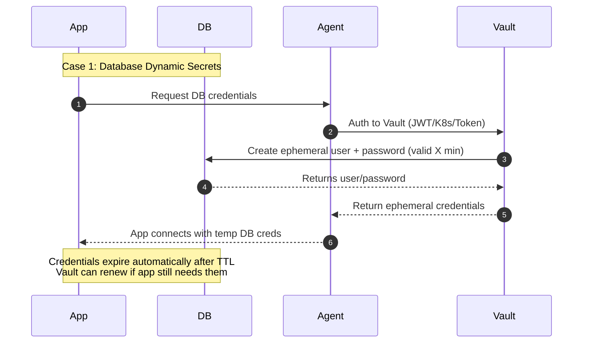
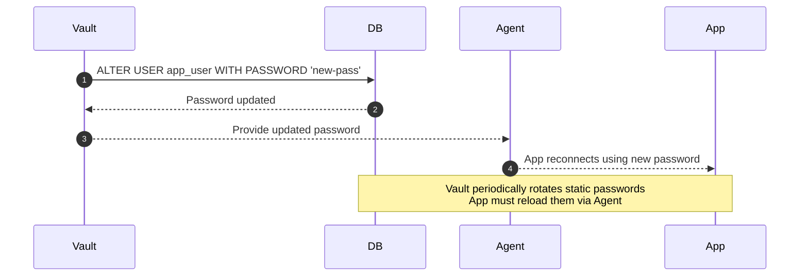
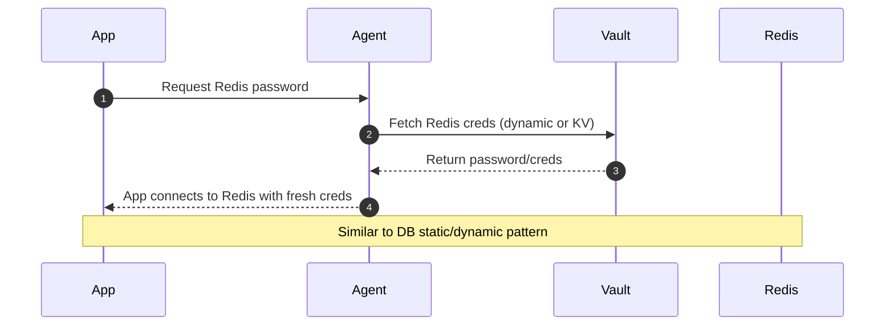
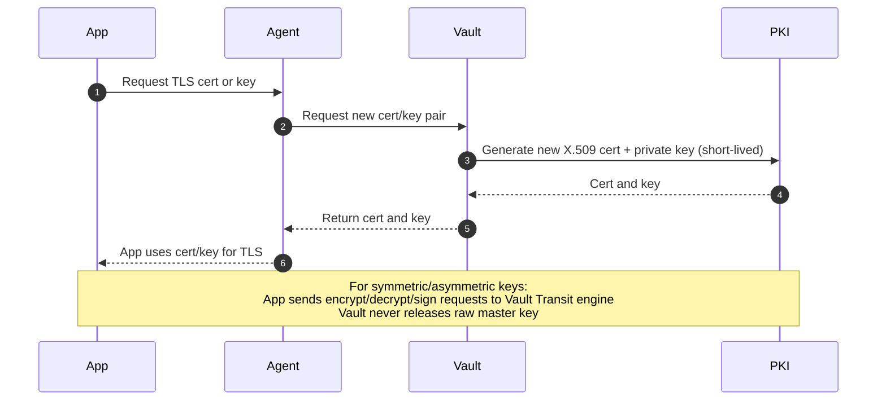

# Key Rotation Pattern

## 1. What Kinds of Keys/Passwords Require Rotation—and Which Don’t?

### Keys/Passwords You Should Rotate

- **Cryptographic keys:**  
    Symmetric keys (used for bulk data encryption) and asymmetric keys (used for signing/encryption) benefit from rotation to limit exposure and cryptanalysis risk.
- **Certificates and SSH keys:**  
    Especially those in long-term use.
- **API keys and tokens:**  
    These can leak, so frequent rotation mitigates long-lived exposure.
- **System/user passwords:**  
    Depending on sensitivity and context, rotation may still be good practice.

### Keys/Passwords You May Not Need to Rotate Frequently

- **Static passwords (e.g., for console access):**  
    NIST now recommends rotation only if there's suspicion of compromise, considering the burdens of frequent mandatory changes.
- **Master/root keys:**  
    Well-protected master/root keys (but still need strong protection controls).

---

## 2. Integrating a New Key into Other Systems

**With a centralized Key Management System (KMS):**

1. Rotate or generate the new key via your KMS.
2. Update aliases or key references in your systems/app configs to point to the new key.
3. Many KMS (e.g., AWS KMS) handle decryption automatically using the correct key version—you don’t need to handle it manually.

---

## 3. Recommended Automated Key Management Tools (Considering Cost & Community Support)

**Top choices:**

- **HashiCorp Vault:**  
    Open-source, self-hosted, strong community adoption.
- **AWS KMS:**  
    Fully managed, automatic rotation, deep integration with AWS ecosystem.
- **Azure Key Vault, Google Cloud KMS:**  
    Similarly integrated with their respective cloud ecosystems.
- **Venafi Trust Protection Platform:**  
    Enterprise-grade, feature-rich.

**Price Snapshot:**

- **Google Cloud KMS:** ~$0.06–$3/month per active key version (priced by protection level), and some crypto op fees. Rotation admin ops are free.
- **AWS KMS:** Modest rotation-specific costs (billed for first and second rotation), but free afterward.
- **Vault:** Open-source with no licensing cost—but self-hosting incurs ops overhead.
- **Venafi:** Likely costly, enterprise-focused.

---

## 4. Automation Scope: What Can Be Automated?

**Automation includes:**

- Key generation and rotation, based on schedules or triggers (time-based or on-demand).
- Updating applications—when using a KMS with alias support, the app just points to alias; rotation happens seamlessly.
- Notification & logging—monitoring is often built-in.

**What might remain manual:**

- Legacy systems lacking API integration may require manual key updates.
- Final configuration validation or redeployment might need manual approval.

---

## 5. End-to-End Key Rotation Flow

**Step-by-step flow:**

1. **Define Policy:** Determine which keys rotate, frequency, triggers (time-based or event-based).
2. **Select Tool:** Choose KMS/Vault considering budget, integration, and community support.
3. **Set Up KMS:** Configure rotation schedules or triggers.
4. **Configure Applications:** Use key aliases or secrets fetch logic.
5. **Automate:** Set rotation schedule and pipeline integration.
6. **Rotate:** KMS issues a new key; apps fetch it via alias.
7. **Validate:** Ensure new key works for encryption/decryption.
8. **Old Key Handling:** Keep old key versions for decryption, then retire when safe.
9. **Audit & Monitor:** Monitor logs, set alerts on anomalies.
10. **Disaster Recovery:** Ensure keys are backed up securely, with recovery procedures tested.

---

## 6. Key / Secret Rotation Policy (Best Practices)

| **Key / Secret**                                                     | **Needs Rotation?** | **Recommended Rotation Policy**                                                                               | **Auto or Manual**                  |
| -------------------------------------------------------------------- | ------------------- | ------------------------------------------------------------------------------------------------------------- | ----------------------------------- |
| `jwt.secret` (JWT signing key / HMAC)                                | ✅ Yes               | Every **60–90 days** or immediately on incident (compromise / leakage). Grace period to support old+new keys. | Manual (with key ID + rollover)     |
| `jwt.private/public key` (RSA/ECDSA)                                 | ✅ Yes               | Every **6–12 months** or on event. Use key ID (`kid`) header for smooth transition.                           | Manual / Semi-auto (via KMS/HSM)    |
| `dbpass` (database user passwords)                                   | ✅ Yes               | **30–90 days** (depends on criticality).                                                                      | Automatic (via Vault / AWS RDS)     |
| `appkey`, `appsecret`, `client_id`, `client_secret`                  | ✅ Yes               | **30–90 days**; shorter for high-risk services.                                                               | Automatic if provider supports      |
| `redis.password` / `memcached SASL`                                  | ✅ Yes               | **30–90 days**                                                                                                | Automatic if supported              |
| `access_key_id` / `secret_access_key` (cloud storage, AWS/GCP/Azure) | ✅ Yes               | **90 days max** (AWS IAM best practice). Rotate more often if exposed externally.                             | Automatic (IAM, STS, Vault)         |
| `tls/https certificates`                                             | ✅ Yes               | **90 days** (Let’s Encrypt default) or up to 1 year (org CAs). Prefer short-lived certs.                      | Automatic (Certbot, ACME, etc.)     |
| `ssh key pairs` (server access)                                      | ✅ Yes               | **6–12 months**, or immediately on employee departure. Use ephemeral keys for CI/CD.                          | Manual / Semi-auto (via Vault)      |
| `api tokens` (third-party integrations)                              | ✅ Yes               | Follow provider limits (often **30–90 days**). If long-lived, rotate manually every quarter.                  | Manual / Auto (depends on provider) |
| `k8s service account tokens`                                         | ✅ Yes               | Use **short-lived tokens** (<= 1 day). Rotate automatically via Kubernetes token projection.                  | Automatic                           |
| `k8s secrets`                                                        | ✅ Yes               | Treat same as app secrets → **30–90 days**.                                                                   | Automatic (with External Secrets)   |
| `gpg/pgp keys` (code signing, backups)                               | ✅ Yes               | **12–24 months**, shorter for critical signing keys.                                                          | Manual                              |
| `encryption keys` (AES, symmetric keys)                              | ✅ Yes               | Rotate every **6–12 months** or after **N encryptions** (per compliance). Use key versioning.                 | Automatic (KMS/HSM)                 |
| `master keys` (root encryption keys in KMS)                          | ✅ Yes               | **Annual rotation** (AWS KMS default is yearly).                                                              | Automatic (KMS handles rotation)    |
| `oauth refresh tokens`                                               | ⚠️ Sometimes        | Only if long-lived (e.g., >90 days). Prefer short expiry with re-issuance flow.                               | Manual (depends on provider)        |
| `env vars` like `server`, `port`, `env`                              | ❌ No                | Not sensitive, rotation not needed.                                                                           | N/A                                 |


--- 

## 7. Vault Model and Sequence Diagram
```
                ┌──────────────────────────┐
                │      HashiCorp Vault     │
                │   (centralized secrets)  │
                └─────────────▲────────────┘
                              │
                        (secure channel)
                              │
          ┌───────────────────┴───────────────────┐
          │                                       │
┌────────────────────┐                  ┌─────────────────────┐
│    Vault Agent     │                  │     Vault Agent     │
│   (sidecar/local)  │                  │   (sidecar/local)   │
└─────────▲──────────┘                  └──────────▲──────────┘
          │                                        │
   ┌──────┴──────┐                          ┌──────┴──────┐
   │   App A     │                          │   App B     │
   │ (JWT, Redis)│                          │ (DB client) │
   └─────────────┘                          └─────────────┘
```

    --- CASE 1: DB DYNAMIC SECRETS ---


    --- CASE 2: DB STATIC SECRETS ---


    --- CASE 3: REDIS SECRETS ---


    --- CASE 4: CERTIFICATES & KEYS ---

---
## 8. Summary
How KMS Relates to Key Rotation:
1. **Centralized Key Management**

   * KMS acts as the **single source of truth** for encryption keys, secrets, and credentials.
   * Instead of embedding secrets in apps or config files, applications fetch them from KMS at runtime.

2. **Automatic Rotation**

   * Most KMS tools support **policy-driven rotation** (e.g., rotate every 90 days).
   * Example: AWS KMS auto-rotates CMKs every 1 year by default; Vault can rotate DB credentials daily or even per-request.
   * This eliminates human error and enforces compliance.

3. **Ephemeral / Short-Lived Credentials**

   * KMS can **issue temporary credentials** (e.g., DB password valid for 1 hour, TLS cert valid for 90 days).
   * Rotation pattern becomes **built-in**, because secrets expire naturally.

4. **Versioned Keys (Key ID / Alias)**

   * KMS stores multiple versions of a key.
   * During rotation, **new versions are activated** while old ones remain available for a grace period.
   * Applications can still decrypt older data until the old version is retired.

5. **Seamless Integration with Apps**

   * Applications don’t manage rotation logic directly. They simply request `getSecret("dbpass")`.
   * KMS decides whether that’s version 3 or version 10.
   * This makes the **rotation process transparent** to developers.

---

✅ **Summary:**
KMS systems like Vault, AWS KMS, GCP KMS, and Azure Key Vault don’t just store keys — they **automate rotation**, issue **short-lived credentials**, support **key versioning**, and make secret usage **transparent** to applications. This reduces manual work, minimizes exposure, and ensures compliance.

---
## 9. Implementation
See the demo [here](/notes/key_rotation_pattern/demo/README.md)