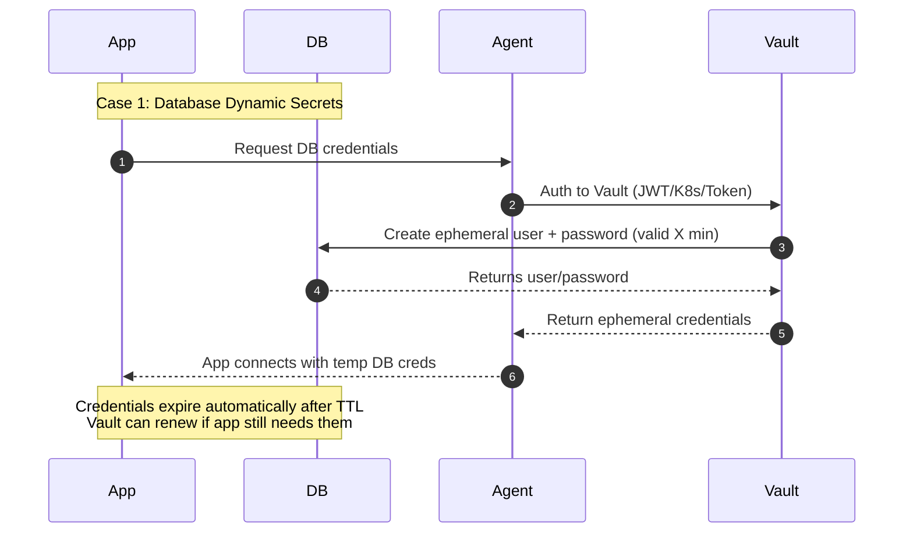
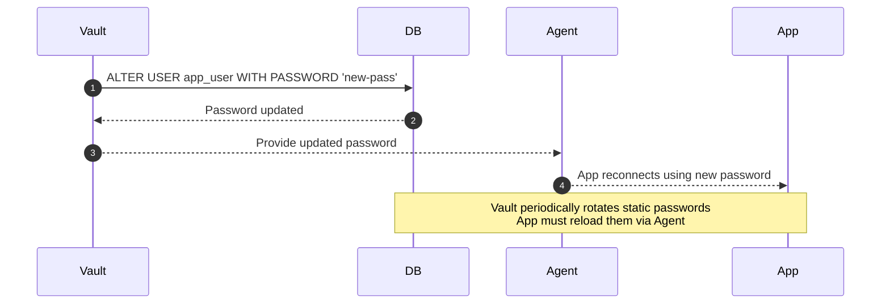
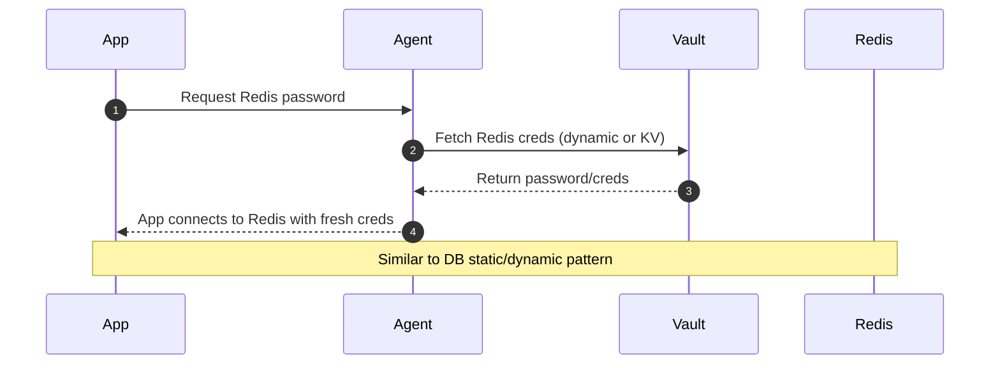
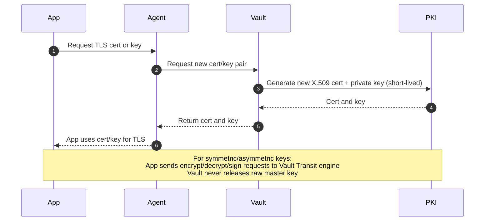

# Key Rotation Pattern

## 1. What Kinds of Keys/Passwords Require Rotation—and Which Don’t?

### Keys/Passwords You Should Rotate

- **Cryptographic keys:**  
    Symmetric keys (used for bulk data encryption) and asymmetric keys (used for signing/encryption) benefit from rotation to limit exposure and cryptanalysis risk.
- **Certificates and SSH keys:**  
    Especially those in long-term use.
- **API keys and tokens:**  
    These can leak, so frequent rotation mitigates long-lived exposure.
- **System/user passwords:**  
    Depending on sensitivity and context, rotation may still be good practice.

### Keys/Passwords You May Not Need to Rotate Frequently

- **Static passwords (e.g., for console access):**  
    NIST now recommends rotation only if there's suspicion of compromise, considering the burdens of frequent mandatory changes.
- **Master/root keys:**  
    Well-protected master/root keys (but still need strong protection controls).

---

## 2. Integrating a New Key into Other Systems

**With a centralized Key Management System (KMS):**

1. Rotate or generate the new key via your KMS.
2. Update aliases or key references in your systems/app configs to point to the new key.
3. Many KMS (e.g., AWS KMS) handle decryption automatically using the correct key version—you don’t need to handle it manually.

---

## 3. Recommended Automated Key Management Tools (Considering Cost & Community Support)

**Top choices:**

- **HashiCorp Vault:**  
    Open-source, self-hosted, strong community adoption.
- **AWS KMS:**  
    Fully managed, automatic rotation, deep integration with AWS ecosystem.
- **Azure Key Vault, Google Cloud KMS:**  
    Similarly integrated with their respective cloud ecosystems.
- **Venafi Trust Protection Platform:**  
    Enterprise-grade, feature-rich.

**Price Snapshot:**

- **Google Cloud KMS:** ~$0.06–$3/month per active key version (priced by protection level), and some crypto op fees. Rotation admin ops are free.
- **AWS KMS:** Modest rotation-specific costs (billed for first and second rotation), but free afterward.
- **Vault:** Open-source with no licensing cost—but self-hosting incurs ops overhead.
- **Venafi:** Likely costly, enterprise-focused.

---

## 4. Automation Scope: What Can Be Automated?

**Automation includes:**

- Key generation and rotation, based on schedules or triggers (time-based or on-demand).
- Updating applications—when using a KMS with alias support, the app just points to alias; rotation happens seamlessly.
- Notification & logging—monitoring is often built-in.

**What might remain manual:**

- Legacy systems lacking API integration may require manual key updates.
- Final configuration validation or redeployment might need manual approval.

---

## 5. End-to-End Key Rotation Flow

**Step-by-step flow:**

1. **Define Policy:** Determine which keys rotate, frequency, triggers (time-based or event-based).
2. **Select Tool:** Choose KMS/Vault considering budget, integration, and community support.
3. **Set Up KMS:** Configure rotation schedules or triggers.
4. **Configure Applications:** Use key aliases or secrets fetch logic.
5. **Automate:** Set rotation schedule and pipeline integration.
6. **Rotate:** KMS issues a new key; apps fetch it via alias.
7. **Validate:** Ensure new key works for encryption/decryption.
8. **Old Key Handling:** Keep old key versions for decryption, then retire when safe.
9. **Audit & Monitor:** Monitor logs, set alerts on anomalies.
10. **Disaster Recovery:** Ensure keys are backed up securely, with recovery procedures tested.

---

## 6. Example for rotation Policy

| **Key / Secret**                       | **Needs Rotation?** | **Best Practice**                   | **Auto or Manual**           |
| -------------------------------------- | ------------------- | ----------------------------------- | ---------------------------- |
| `jwt.secret` (JWT signing key)         | Yes                 | Rotate every 60–90 days or on event | Manual (graceful transition) |
| `dbpass` (each database)               | Yes                 | Frequent rotation                   | Automatic via secrets tools  |
| `appkey`, `appsecret`, etc.            | Yes                 | Rotate frequently                   | Automatic if supported       |
| `redis.password`                       | Yes                 | Rotate frequently                   | Automatic if supported       |
| `accesskeyid`, `secretkeyid` (storage) | Yes                 | Frequent rotation                   | Automatic if supported       |
| `server`, `port`, `env`, etc.          | No                  | Not sensitive                       | N/A                          |


--- 

## 7. Vault Model and Sequence Diagram
```
                ┌──────────────────────────┐
                │      HashiCorp Vault     │
                │   (centralized secrets)  │
                └─────────────▲────────────┘
                              │
                        (secure channel)
                              │
          ┌───────────────────┴───────────────────┐
          │                                       │
┌────────────────────┐                  ┌─────────────────────┐
│    Vault Agent     │                  │     Vault Agent     │
│   (sidecar/local)  │                  │   (sidecar/local)   │
└─────────▲──────────┘                  └──────────▲──────────┘
          │                                        │
   ┌──────┴──────┐                          ┌──────┴──────┐
   │   App A     │                          │   App B     │
   │ (JWT, Redis)│                          │ (DB client) │
   └─────────────┘                          └─────────────┘
```

    --- CASE 1: DB DYNAMIC SECRETS ---


    --- CASE 2: DB STATIC SECRETS ---


    --- CASE 3: REDIS SECRETS ---


    --- CASE 4: CERTIFICATES & KEYS ---
