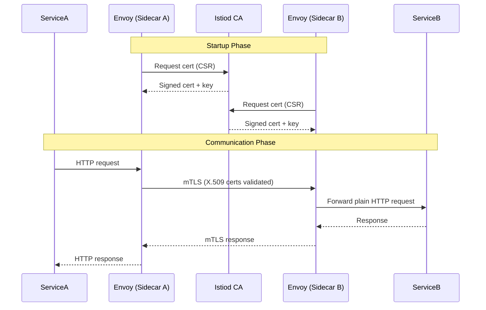
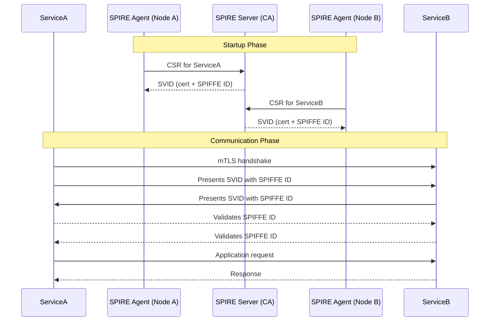
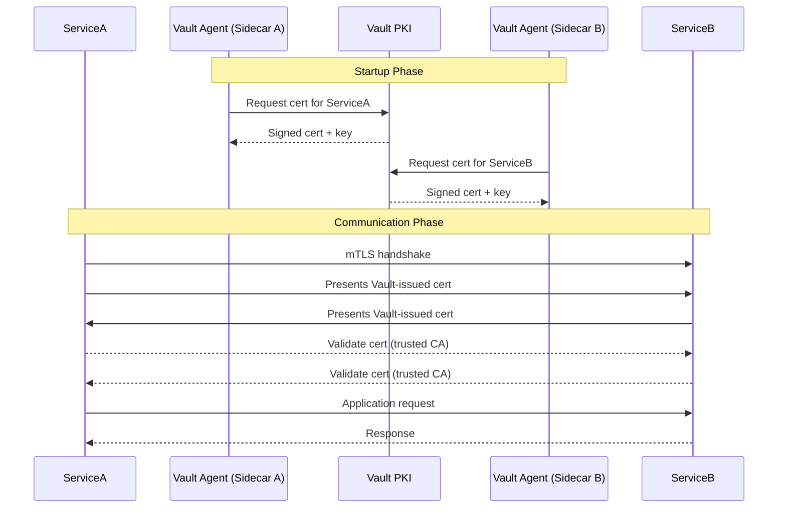

# Zero Trust Architecture

## 🔑 Core Principles of Zero Trust

1. **Verify Explicitly**  
        Always authenticate and authorize based on all available data points: identity, device health, location, service, workload, etc.

2. **Least Privilege Access**  
        Grant users, devices, and applications only the minimum access they need. Enforce just-in-time and just-enough-access.

3. **Assume Breach**  
        Design security controls as if an attacker is already inside your network:
        - Segment networks and services.
        - Monitor continuously.
        - Contain threats by limiting lateral movement.

---

## High Level Architecture

```
+------------------------ Cloud / Internet ------------------------+
|                                                                  |
|  Users / Clients  -->  API Gateway  -->  Ingress (mTLS to mesh)  |
|                                 |                                 |
+---------------------------------v---------------------------------+
                                  |
                     +------------+-------------+
                     |   Kubernetes Cluster     |
                     |  (Service Mesh Enabled)  |
                     +------------+-------------+
                                  |
     +-----------------------------+-------------------------------+
     |                             |                               |
+----v----+                  +-----v-----+                   +-----v-----+
| Service |                  |  Service  |                   |  Service  |
|  A      |<-------mTLS----->|    B      |<-------mTLS------>|    C      |
| (API)   |                  | (AuthZ)   |                   | (Worker)  |
+----+----+                  +-----+-----+                   +-----+-----+
     |                              |                               |
     | OPA                          | JWT/Policy                    |
     |                               \                              |
     |                                \                             |
     |                                 v                            |
     |                         +--------------+                     |
     |                         |  OPA Agent   |<---- Rego Policies  |
     |                         +--------------+                     |
     |                                                              |
     |                         +--------------+                     |
     +-----------------------> |  HashiCorp   |  <--- PKI/Secrets   |
                               |   Vault      |                     |
                               +-------+------+                     |
                                       |                            |
                                       | Dynamic DB creds / TLS     |
                                       v                            v
                               +--------------+            +---------------+
                               |   Database   |            |  External API |
                               |  (Postgres)  |            |   Providers   |
                               +--------------+            +---------------+
```

**Trust anchors:**

* **Workload identity:** SPIFFE/SPIRE or mesh-issued identities (e.g., Istio Citadel).
* **Network trust:** mTLS everywhere (mesh), deny‑by‑default L4/L7 ACLs.
* **App trust:** JWT/OIDC for end‑user identity, OPA for ABAC/RBAC.
* **Secrets trust:** Vault for short‑lived DB creds & PKI.

---

## 🔐 mTLS vs TLS Decision Matrix

| Communication Pair            | Use Case                                    | Recommended Security Setup                                                                                                       |
| ----------------------------- | ------------------------------------------- | -------------------------------------------------------------------------------------------------------------------------------- |
| **Service ↔ Service**         | Microservices / API calls inside your infra | ✅ **mTLS** (short-lived certs via cert-manager, Vault, or SPIRE).<br>Strong service identity, encrypted traffic.                 |
| **Frontend ↔ Backend**        | Browser / Mobile App → API                  | ❌ No mTLS.<br>✅ Use **TLS (server cert only)** + **JWT/OAuth2/API keys** for client auth.                                        |
| **Service ↔ Database**        | App → DB (Postgres, MySQL, etc.)            | ⚖️ Either:<br> - ✅ **TLS + password/role** (simpler, common).<br> - ✅ **mTLS** if you have PKI automation (Vault, cert-manager). |
| **Service ↔ Message Broker**  | Kafka, RabbitMQ, NATS, etc.                 | ⚖️ Often support mTLS.<br>✅ Use mTLS if your PKI is automated (e.g., Kafka + Vault).<br>Otherwise TLS + SASL/username.           |
| **Service ↔ Third-party API** | Stripe, AWS, Google, etc.                   | ❌ Almost never mTLS (providers don’t support it).<br>✅ TLS (server cert only) + **API key / OAuth token**.                       |
| **Service ↔ B2B Partner API** | Bank, legacy enterprise API                 | ✅ Sometimes **mTLS required** (they issue you a client cert).<br>Usually static certs + manual renewal.                          |


### ✅ Rules of Thumb

* **mTLS is best for internal service-to-service auth** where you control both sides.
* **Frontend clients (users) should never manage certs** → use tokens instead.
* **Databases/message brokers** → mTLS is “defense in depth”, but not strictly required unless compliance needs it.
* **3rd-party APIs** → mTLS only if explicitly required. Otherwise, tokens/keys.


⚡ Shortcut:

* **Inside cluster (trust boundary):** mTLS.
* **Outside cluster (users, SaaS APIs):** TLS + tokens.
* **Infra (DB/broker):** TLS + password/role is enough unless you’re in high-security or regulated environments → then mTLS.

---

## 🔐 mTLS Approaches: Istio vs. SPIFFE/SPIRE vs. Vault PKI

Mutual TLS (mTLS) ensures **both client and server authenticate each other** using certificates. The challenge is:

* How to **issue certificates**?
* How to **renew them automatically**?
* How to make services use them **without changing app code**?

These three approaches solve the problem differently.

---

### 1. **Istio (Service Mesh)**

#### Concept

* Istio is a **service mesh**. It injects a **sidecar proxy (Envoy)** next to every service.
* Envoy handles **mTLS**, routing, retries, metrics, logging, etc.
* Istio has its own CA (`istiod`) to issue and rotate certs automatically.
* Applications **do not need to change** — they just talk over plain HTTP/TCP, Envoy upgrades it to mTLS.

#### Sequence Diagram



#### Pros

* ✅ **Zero app code change** (sidecar does TLS).
* ✅ Full service mesh features (traffic control, observability, retries).
* ✅ Automatic cert issuance & rotation.

#### Cons

* ❌ Heavyweight (adds complexity, CPU/memory overhead).
* ❌ More components to operate (control plane, sidecars).
* ❌ Overkill if you only need mTLS without mesh features.

---

### 2. **SPIFFE / SPIRE**

#### Concept

* **SPIFFE (Spec)** defines a standard identity format: `spiffe://<trust-domain>/<path>`.
* **SPIRE (Runtime)** issues **X.509 SVIDs** (certificates) or JWTs that encode these SPIFFE IDs.
* Applications or sidecars can use these SVIDs for mTLS authentication.
* SPIRE runs agents on each node to automatically fetch and rotate certs.

#### Sequence Diagram



#### Pros

* ✅ Standardized identity (SPIFFE IDs portable across systems).
* ✅ Automatic cert issuance & rotation.
* ✅ Flexible: can be integrated with Istio, Envoy, or custom apps.
* ✅ Lighter than full Istio if you only want identity + mTLS.

#### Cons

* ❌ Apps (or sidecars) may need some integration with SPIRE Agent.
* ❌ Less feature-rich than Istio (no traffic routing, observability).
* ❌ Learning curve around SPIFFE/SVID concepts.

---

### 3. **Vault PKI**

#### Concept

* HashiCorp Vault has a **PKI secrets engine** that acts as a Certificate Authority.
* Services (or agents) request short-lived certificates.
* Vault issues certs, and services store them locally (e.g., in a file).
* Services must load and use these certs in their TLS config for mTLS.

#### Sequence Diagram



#### Pros

* ✅ Very flexible PKI system.
* ✅ Good for both humans (devs) and machines (services).
* ✅ Powerful policies and secrets management.

#### Cons

* ❌ App code must use the certs (unless wrapped by Vault Agent + proxy).
* ❌ More manual integration than Istio or SPIRE.
* ❌ If certs expire and service doesn’t reload them → outages.


### 🔎 Comparison Table

| Feature               | Istio (Mesh)                         | SPIFFE/SPIRE (Identity)                        | Vault PKI                         |
| --------------------- | ------------------------------------ | ---------------------------------------------- | --------------------------------- |
| Acts as CA            | Yes (`istiod`)                       | Yes (SPIRE Server)                             | Yes (PKI engine)                  |
| Cert Auto-Rotation    | ✅ Fully auto (via Envoy)             | ✅ Auto (via agent)                             | ⚠️ Yes, but service must reload   |
| Code Changes Required | ❌ No (sidecar)                       | ⚠️ Sometimes (unless Envoy used)               | ✅ Yes (unless agent + proxy used) |
| Extra Features        | Traffic mgmt, observability, retries | Identity standardization                       | Secrets mgmt, policies            |
| Complexity            | High                                 | Medium                                         | Medium–High                       |
| Best Use Case         | Full service mesh with policies      | Standardized workload identity across clusters | Flexible PKI + mTLS without mesh  |


### 📝 Final Take

* **Use Istio** if you want **mTLS + service mesh features** and don’t want to touch app code.
* **Use SPIFFE/SPIRE** if you want **portable, standard identity (SPIFFE IDs)** with automatic cert rotation but not a full mesh.
* **Use Vault PKI** if you already use Vault for secrets and want a **flexible PKI authority**, but you’ll need to handle certificate reloads in apps.

You can see the simple demo for mTLs [here](https://github.com/ysmnababan/learn_cryptography/tree/master/notes/zero_trust_policy/manual-mTLS).
The implementation only cover manual mTLS. 
For the `Vault PKI` or the `Istio` implementation is not needed for now because this mTLS approach
is only helpful for more complex and distributed service. The demo will be updated whenever the system is changing toward distributed approach.

---
